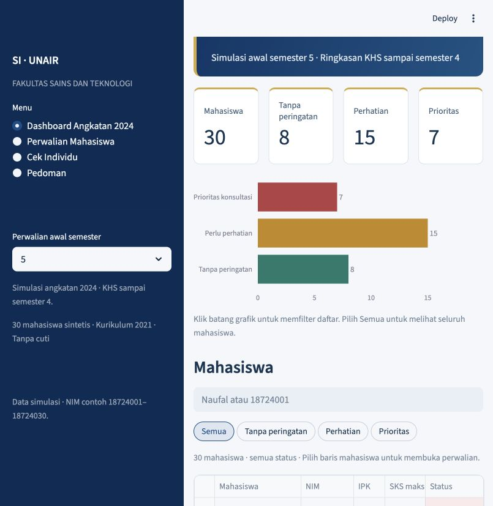
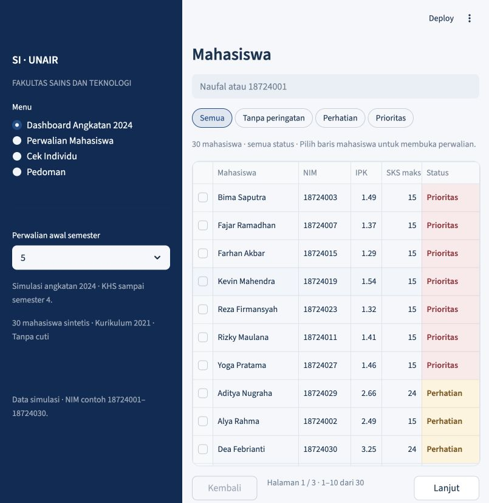
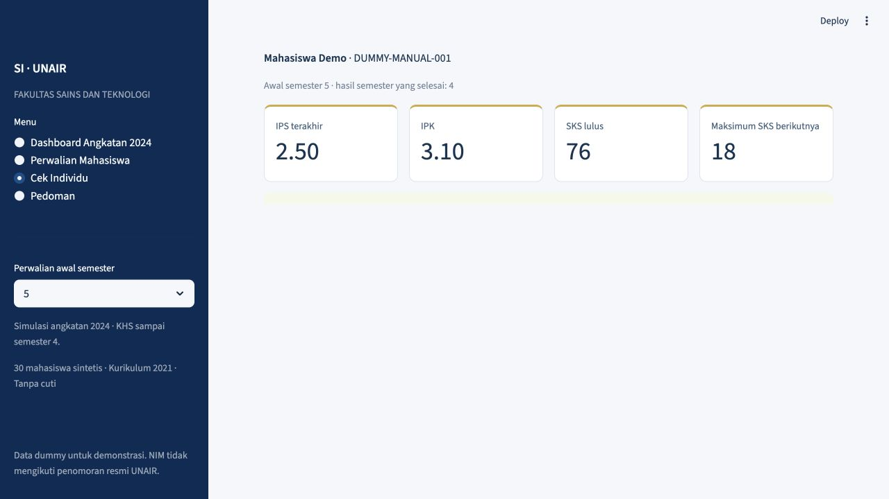

# Academic Advising Decision Support System (AADSS)
### Undergraduate Information Systems — Universitas Airlangga (Cohort 2024)

[](https://www.python.org/)
[](https://streamlit.io/)
[](https://pandas.pydata.org/)
[](https://plotly.com/)
[]()
[]()
[]()

A lightweight, rule-based **Academic Advising Decision Support System** designed for faculty academic advisors (*Dosen Wali*) in the **Undergraduate Information Systems Program, Faculty of Science and Technology (FST), Universitas Airlangga**.

Built with **Streamlit**, this application provides automated semester-by-semester study progress monitoring, dynamic Study Plan (*KRS*) credit ceiling calculations, early warning risk detection for academic evaluations, and an ad-hoc **Individual Check** calculator that functions completely independent of preloaded datasets.

---

## 📸 Interface Preview

| Cohort Dashboard & Risk Distribution | Filtered Student Roster & Academic Status |
| :---: | :---: |
|  |  |

| Ad-hoc Individual Check (Dataset-free Simulation) |
| :---: |
|  |

---

## 🎯 Key Capabilities

- **Interactive Cohort Monitoring (Cohort 2024)**
  - Multi-period advising review: evaluate student cohorts entering semesters 2 through 5.
  - Interactive Plotly chart: click category bars (*No Warning*, *Needs Attention*, *Priority Consultation*) to dynamically filter student rosters.
  - Sub-second search by Student Name or Student ID (*NIM*).
  - Clean paginated roster (10 records per page) with high-contrast status badges.
  - Full dataset export in CSV format reflecting active filter states.

- **Student Advising Profile (Detailed View)**
  - Historical transcript analysis spanning Semesters 1 to 4.
  - Automated determination of maximum allowable credit load (*SKS*) for the upcoming term.
  - Real-time Study Plan (*KRS*) validation with automated overload detection.
  - Progress projection estimating the expected graduation term based on historical pace.

- **Ad-Hoc Individual Check (Standalone Calculator)**
  - Zero-dataset mode: enables advisors or students from any cohort to simulate scenarios by providing semester transcript summary inputs.
  - Computes credit ceilings, evaluates checkpoints, and flags warnings on demand.
  - Fully client-side session: zero data persistence, safeguarding user confidentiality.

- **Academic Policy Transparency**
  - Explicit rule engine parameters matched directly with page citations from the official FST Academic Handbook.
  - Direct download access to original source references and dataset artifacts.

---

## 📐 Academic Rules & Rule Engine Specification

The system implements the academic policies defined in **`docs/pedoman_fst_2024_2025.pdf`** (*Buku Pedoman Pendidikan FST Universitas Airlangga*) and the **2021 Information Systems Curriculum**:

### 1. Credit Ceiling (*Beban SKS Maksimum*)
Determined strictly by the preceding semester's Grade Point Average (*IPS*) *(Handbook p. 15)*:

| Preceding Semester IPS | Maximum Allowable SKS |
| :---: | :---: |
| **< 2.00** | **15 SKS** |
| **2.00 – 2.50** | **18 SKS** |
| **2.51 – 3.00** | **20 SKS** |
| **> 3.00** | **24 SKS** |

### 2. Milestone Evaluations & Graduation Criteria
- **Semester 4 Checkpoint:** Requires at least **40 cumulative SKS passed** with a cumulative **GPA $\ge$ 2.00** *(Handbook p. 22)*.
- **Semester 8 Checkpoint:** Requires at least **80 cumulative SKS passed** with a cumulative **GPA $\ge$ 2.00** *(Handbook p. 22)*.
- **GPA Warning Threshold:** Cumulative GPA below 2.00 triggers an academic warning *(Handbook p. 26)*.
- **Maximum "D" Grade Threshold:** Grade "D" counts as passing credit; however, total SKS with grade "D" must not exceed **20%** of total graduation credits *(Handbook pp. 16, 22)*.
- **"E" Grade Prohibition:** No "E" grades are permitted for graduation. Because synthetic dataset instances omit "E" grades, the absence of "E" on an official transcript remains explicitly marked as **Unverified** until certified by the academic bureau.
- **Study Duration:** Standard duration is 8 semesters; maximum allowed study period is 14 semesters without academic leave.
- **Degree Target:** Configured to a baseline target of **144 SKS**.

### 3. Degree Completion Projection Formula
```text
completed_semesters = upcoming_semester - 1
credit_velocity     = min(passed_sks / completed_semesters, allowable_sks_by_ips)
remaining_sks       = max(0, 144 - passed_sks)
estimated_term      = completed_semesters + ceil(remaining_sks / credit_velocity)
```

### 4. Advisory Risk Classification
- 🟢 **No Warning Detected:** All academic metrics meet or exceed normative requirements.
- 🟡 **Needs Attention:** Triggered by cumulative GPA < 2.00, D-grade ratio > 20%, proposed KRS exceeding limit, zero credit velocity, or projected completion exceeding 8 semesters.
- 🔴 **Priority Consultation:** Overdue mandatory checkpoint (Semesters 4 or 8) not met, or projected study duration exceeds the maximum institutional limit of 14 semesters.

---

## 📂 Project Structure

```text
academic-advising-dss/
├── .streamlit/
│   └── config.toml             # Custom theme tokens & server parameters
├── data/
│   ├── mahasiswa.csv           # 30 synthetic student profiles (NIM 18724001–18724030)
│   ├── nilai.csv               # 998 course enrollment records (Semesters 1–4)
│   ├── ringkasan_semester.csv  # 120 semester performance summaries
│   └── kurikulum_2021.csv      # 78 catalog courses with ECTS-to-SKS conversions
├── docs/
│   └── pedoman_fst_2024_2025.pdf # Official FST UNAIR Academic Handbook
├── tests/
│   ├── test_app.py             # Streamlit AppTest interface & workflow assertions
│   └── test_rules.py           # Academic rule validation & edge-case unit tests
├── academic.py                 # Core academic calculus (KHS, transcript, credit caps)
├── app.py                      # Main Streamlit web application
├── generate_dummy.py           # Deterministic synthetic data generator (Seed 2024)
├── risk.py                     # Academic risk assessment & classification engine
├── rules.json                  # Academic thresholds, rule weights, and citations
├── validate_data.py            # Dataset reconciliation and audit verification script
├── Jalankan.command            # One-click launch executable for macOS
├── requirements.txt            # Production dependencies
└── README.md                   # Project documentation
```

---

## 🚀 Getting Started

### Prerequisites
- Python **3.12** or higher.

### Quick Start (macOS)
If running on macOS, simply double-click:
```bash
Jalankan.command
```
This automatically verifies dependencies and opens the web application at `http://127.0.0.1:8501`.

### Manual Installation (macOS / Linux / Windows)

1. **Clone the repository:**
   ```bash
   git clone https://github.com/<your-username>/academic-advising-dss.git
   cd academic-advising-dss
   ```

2. **Create and activate a virtual environment:**
   - *macOS / Linux:*
     ```bash
     python3 -m venv .venv
     source .venv/bin/activate
     ```
   - *Windows (PowerShell):*
     ```powershell
     python -m venv .venv
     .venv\Scripts\Activate.ps1
     ```

3. **Install dependencies:**
   ```bash
   pip install -r requirements.txt
   ```

4. **Launch the application:**
   ```bash
   streamlit run app.py
   ```
   Open your browser and navigate to `http://127.0.0.1:8501`.

---

## 🧪 Testing & Data Verification

The codebase includes full automated test coverage and dataset validation scripts to guarantee rule correctness and reproducible state:

1. **Run Dataset Integrity Audit:**
   ```bash
   python3 validate_data.py
   ```
   *Recomputes all 120 semester summaries from 998 enrollment records and validates zero discrepancies.*

2. **Run Automated Test Suite:**
   ```bash
   python3 -m unittest discover -s tests -v
   ```
   *Executes 23 test cases covering boundary values (IPS/KRS), 20% D-grade cutoffs, checkpoint evaluations, UI interaction states, and page navigation.*

3. **Regenerate Synthetic Dataset (Optional):**
   ```bash
   python3 generate_dummy.py
   ```
   *Deterministically recreates synthetic cohort data using Seed 2024.*

---

## 🔒 Data Privacy & Ethics

- **100% Synthetic Data:** All student names, ID numbers (*NIM 18724001–18724030*), and grade trajectories in this repository are **synthetically generated**. They do not correspond to any real individuals or official student records.
- **Local-Only Execution:** The tool runs on a local host (`127.0.0.1`) without external cloud telemetry, database connections, or tracking scripts.
- **Decision Support Scope:** This tool acts as an assistive decision aid for advisors and students. Final administrative and academic determinations remain subject to official university governance.

---

## 📄 License

This project is licensed under the [MIT License](LICENSE).
