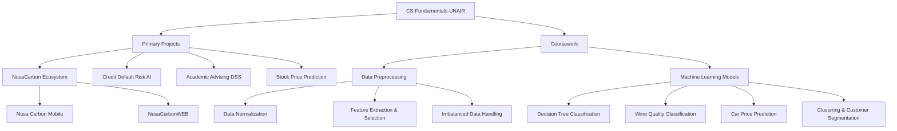

# CS-Fundamentals-UNAIR

📚 **Academic Projects & Development Portfolio** · Information Systems, Universitas Airlangga (UNAIR)

A collection of data science, machine learning, and software engineering projects completed during the Information Systems program at **Universitas Airlangga**. The repository is split into **primary projects** (full applications) and **coursework** (focused assignments on individual techniques). Every folder is self-contained and has its own README.

---

## 🗺️ Repository Map

---

## 🚀 Primary Projects

### 1. NusaCarbon Ecosystem (Mobile & Web)

A digital marketplace for trading carbon credit tokens with dMRV (digital Measurement, Reporting and Verification) workflows.

- **[`Nusa Carbon Mobile`](./Nusa%20Carbon%20Mobile)**: a **Flutter** client for buyers and project owners, backed by a **Spring Boot** API. It shows portfolio metrics, hosts dMRV upload forms, and simulates blockchain transaction states. A release APK is included.
- **[`NusaCarbonWEB`](./NusaCarbonWEB)**: a **PHP + MySQL** web portal with role-based dashboards for Buyers, Project Owners, Verifiers and Admins. It runs locally with Docker and deploys to Railway. A static HTML/CSS prototype is included alongside it.

### 2. [`Credit Default Risk AI`](./CreditDefaultRiskAI)

A Streamlit dashboard that predicts next-month credit card default risk.

- Compares a **Deep Neural Network (MLP)** with a hybrid **PCA-DNN** pipeline (TensorFlow).
- Evaluated on 80/20, 75/25 and 70/30 train-test splits, with **SMOTE** applied only to training data to avoid leakage.
- Includes single-customer prediction and SQLite-backed prediction history.

### 3. [`Academic Advising Decision Support System (AADSS)`](./Academic%20Advising%20Decision%20Support%20System%20%28AADSS%29)

A rule-based decision support tool for academic advisors (*Dosen Wali*) in the Information Systems program at UNAIR.

- Semester-by-semester progress monitoring and **KRS credit ceiling** calculation.
- Early-warning risk detection with an interactive Plotly dashboard.
- A standalone **Individual Check** calculator that works without any dataset.
- Covered by unit tests and runs on **synthetic** student data only.

### 4. [`Stock Price Prediction (GA + RF)`](./Stock%20Price%20Prediction%20%28GA%20%2B%20RF%29)

A model pipeline that predicts the price direction of BBCA (Bank Central Asia) stock.

- **Genetic Algorithm** selects the best combination of technical indicators (RSI, MACD, Bollinger Bands, etc.).
- **Random Forest** classifies positive or negative price direction.
- **Decision threshold tuning** maximizes precision to reduce losing trades.
- Full analytics: ROC-AUC curves, GA fitness history, ablation studies, and multi-seed experiments.

---

## 📂 Coursework

| Area | Folder | Methods | Description |
|---|---|---|---|
| **Data Preprocessing** | [`Data Normalization`](./Data%20Normalization) | Min-Max, Z-Score, Robust Scaling | Scales the Lung Cancer and Shopping datasets to remove numerical scale bias. |
| **Dimensionality Reduction** | [`Feature Extraction & Selection`](./Feature%20Extraction%20%26%20Selection) | PCA, ANOVA | Reduces dimensions with PCA (95% variance) and selects relevant features with ANOVA tests. |
| **Resampling** | [`Imbalanced Data Handling`](./Imbalanced%20Data%20Handling) | Random Over/Undersampling | Handles class imbalance on the Wine Quality dataset with `imbalanced-learn`. |
| **Classification** | [`Decision Tree Classification`](./Decision%20Tree%20Classification) | Gini & Entropy Decision Trees | Classifies medical patient data, with visualizations of the top split levels. |
| **Interactive Dashboard** | [`Wine Quality Classification`](./Wine%20Quality%20Classification) | Streamlit, Plotly | Explores wine chemical properties and predicts quality in real time. |
| **Regression & Ensembles** | [`Car Price Prediction`](./Car%20Price%20Prediction) | XGBoost, LightGBM | Compares ensemble regressors to predict used car prices, with a Streamlit app. |
| **Unsupervised Learning** | [`Clustering & Customer Segmentation`](./Clustering%20%26%20Customer%20Segmentation) | K-Means, K-Modes | Segments mall customers and credit card users using Elbow and Silhouette evaluation. |

---

## 🛠️ Tech Stack

| Category | Tools |
|---|---|
| **Languages** | Python, Dart, PHP, Java, JavaScript, SQL |
| **Machine Learning** | scikit-learn, TensorFlow, XGBoost, LightGBM, imbalanced-learn |
| **Data & Visualization** | pandas, NumPy, Matplotlib, Seaborn, Plotly |
| **Apps & Frameworks** | Streamlit, Flutter, Spring Boot, vanilla PHP |
| **Data & Infrastructure** | MySQL, SQLite, Docker, Railway, Streamlit Community Cloud |

---

## ⚙️ Repository Notes

- **`requirements.txt`** at the root is used by Streamlit Community Cloud to deploy the AADSS app.
- **`.railwayignore`** limits Railway deployments to the `NusaCarbonWEB` folder.
- Trained model files (`*.pkl`), logs, build outputs and `.env` files are excluded by `.gitignore`. See each project's README for how to regenerate them.

---

## 👤 Author

**Muhammad Naufal Zaki**
NIM: 187241115
Information Systems, Faculty of Science and Technology, Universitas Airlangga
